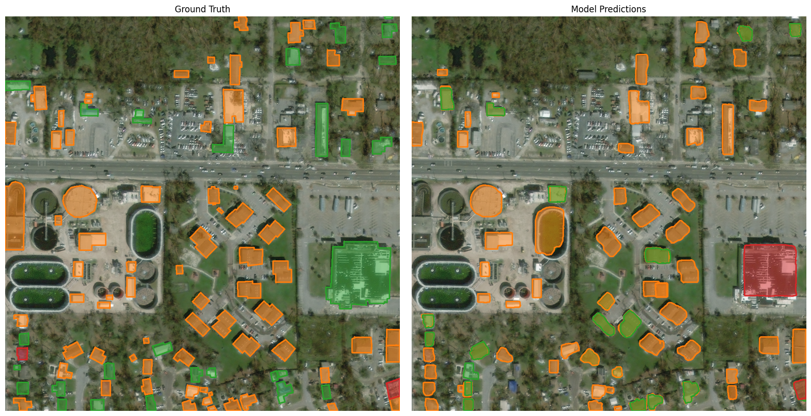

# Building Damage Assessment using Dahitra-RCNN

## Overview

In March 2023, **Cyclone Freddy** caused severe flooding in **Blantyre, Malawi**, devastating communities such as **Chilobwe on Soche Mountain**. The disaster was exacerbated by **inadequate drainage, deforestation, and unregulated urban sprawl**, disproportionately affecting vulnerable groups, including **women, pregnant women, and young girls**.

This project aims to **identify houses** and **assess their damage levels** using satellite imagery. We developed a **Dahitra-RCNN-based model**, trained on the **xBD dataset**, and tested on a curated dataset by the **Kuyesera AI Lab**.

## Dataset

The solution leverages data from:

- **xBD Dataset** (pre-trained disaster damage assessment dataset)
- **Kuyesera AI Lab's hand-labeled dataset** (used for evaluation)
- **Amazon Sustainability Data Initiative (ASDI)** (providing access to large-scale satellite imagery)

### Damage Categories

Each house is classified into one of the following categories:

1. **Destroyed**
2. **Major Damage**
3. **Minor Damage**
4. **No Damage**

## Model: Dahitra-RCNN

We developed a custom **Dahitra-RCNN** (Region-based Convolutional Neural Network) for damage assessment. The model:

- **Detects house locations** in satellite images.
- **Classifies** each house into one of the four damage categories.
- Uses a **6-month time gap** between pre- and post-disaster imagery for accurate assessment.
- Employs **AWS cloud resources** for training and inference.

## Results

Below is an example of model performance on test images:

<!--  -->


## Installation & Usage

### 1. Clone the Repository

```sh
git clone https://github.com/KavinduKariyawasam/dahircnn.git
cd dahircnn
```

### 2. Train the model

```sh
python train.py
```

## Acknowledgments

This project is supported by the AI for Equity Challenge in partnership with IRCAI and AWS. We appreciate AWS’s cloud infrastructure and technical support in deploying this solution. Also we used two NVIDIA Quadro RTX 6000 GPUs from Electronic and Telecommunication department of University of Moratuwa, Sri Lanka.
